# Mockup
the Mockups are drawn in Pencil. ([Version forked by evolus](https://github.com/evolus/pencil)).

## COMMENT Mode

###Mobile
<kbd>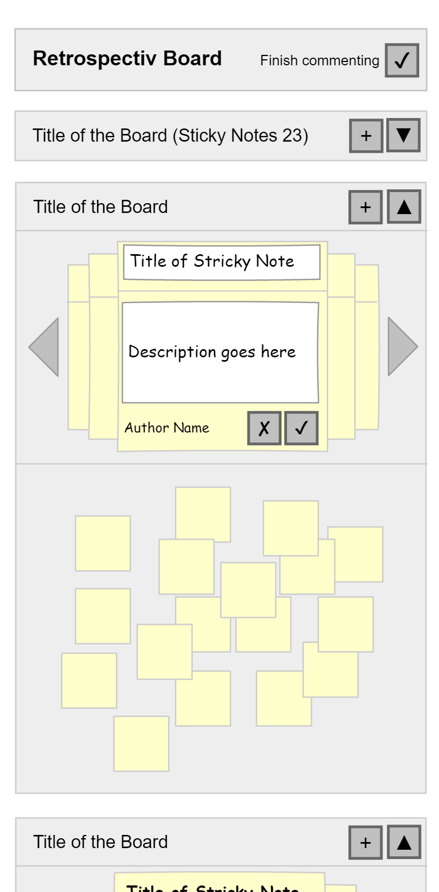</kbd>

###Desktop 
<kbd>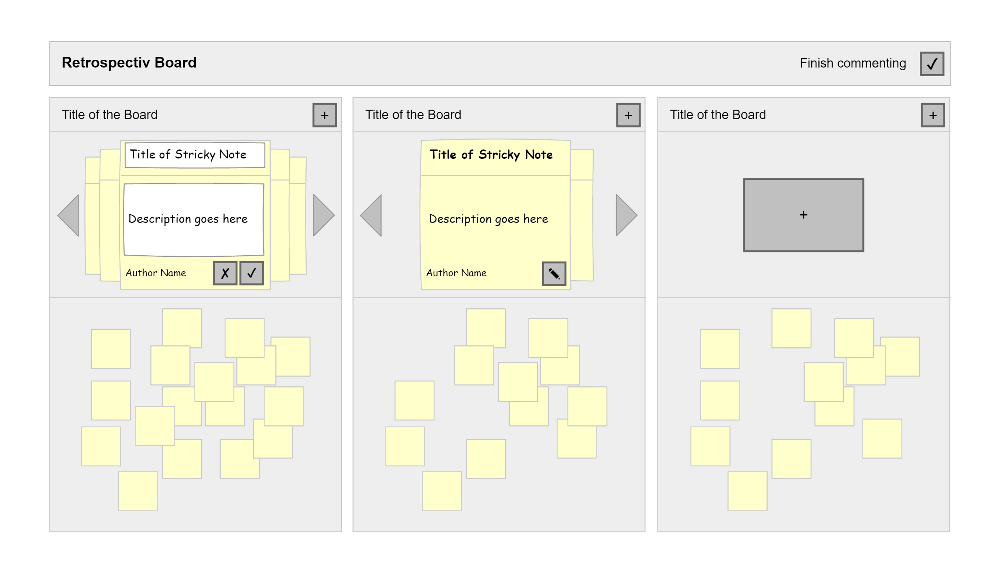</kbd>

## REVIEW Mode

###Mobile
<kbd>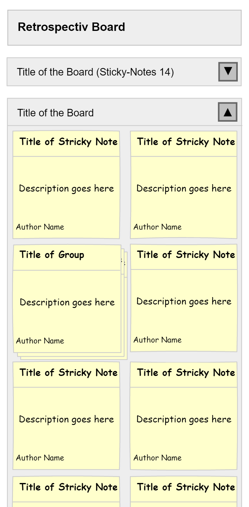</kbd>
 
###Desktop 
<kbd>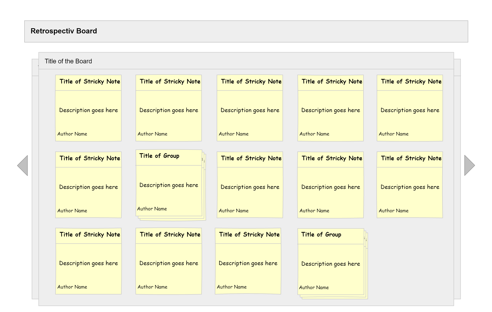</kbd>

###Moderator Grouping
<kbd>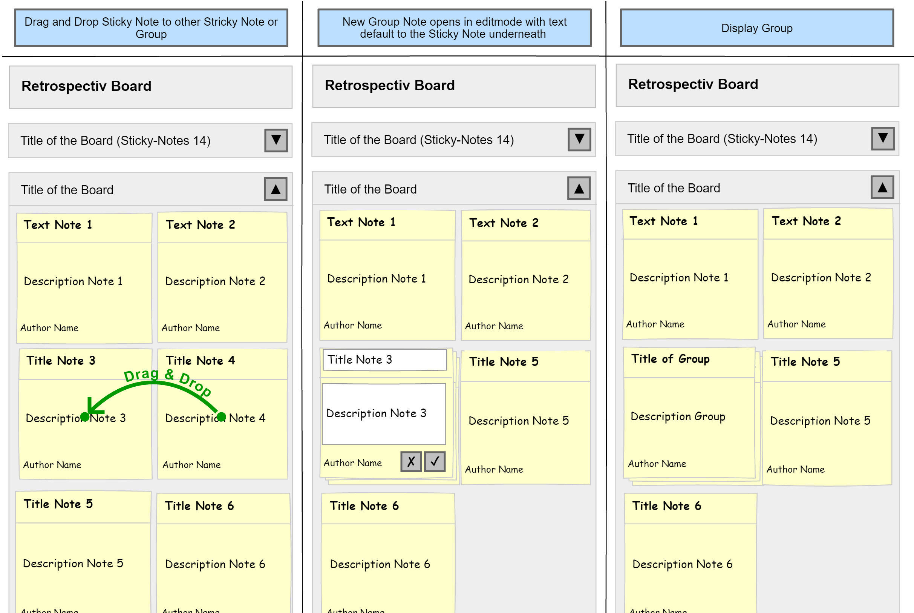</kbd>

## VOTE Mode

###Mobile
<kbd>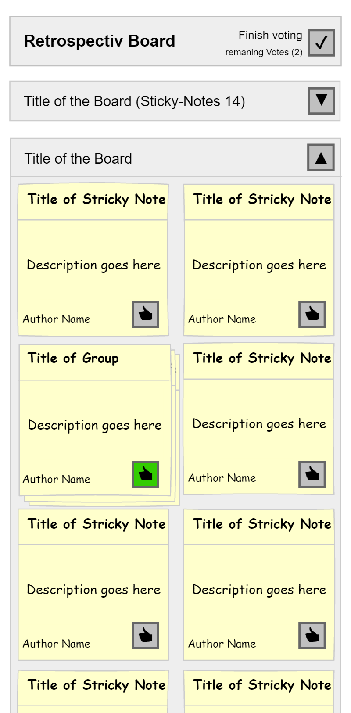</kbd>
 
###Desktop 
<kbd>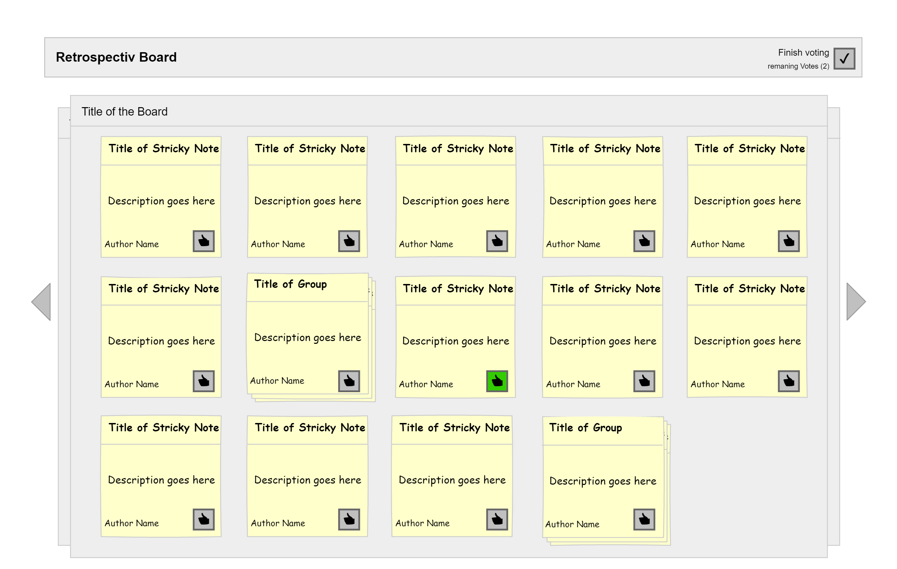</kbd>

## CLOSED Mode

###Mobile
<kbd>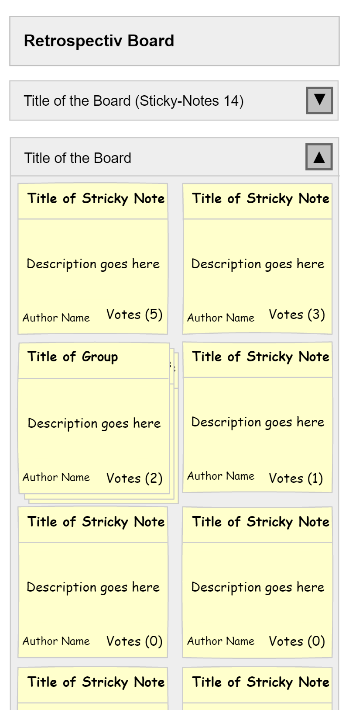</kbd>
 
###Desktop 
<kbd>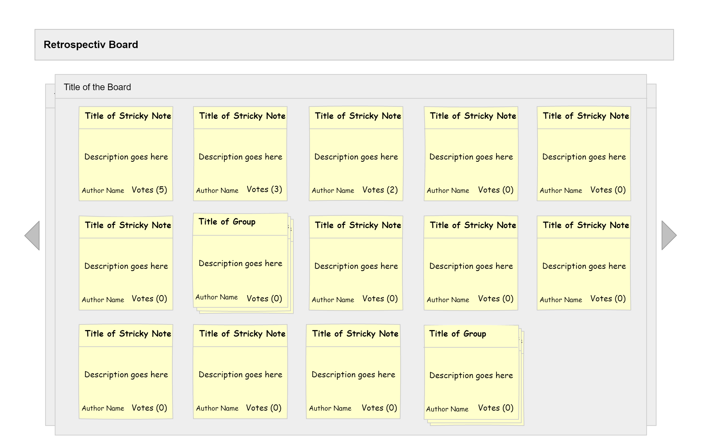</kbd>

## Moderator Panel

###Mobile
<kbd>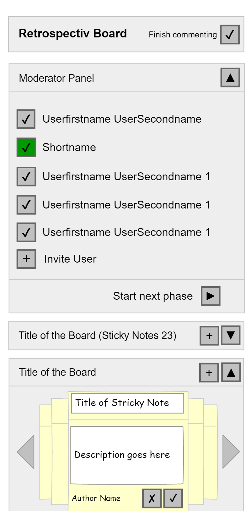</kbd>
 
###Desktop 
<kbd>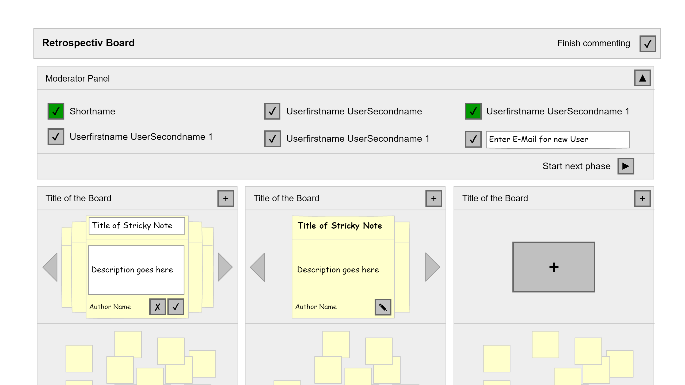</kbd>