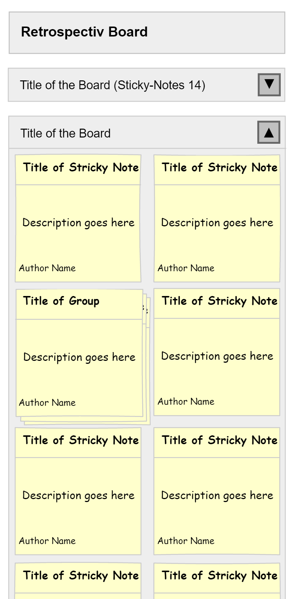

# Mockup
the Mockups are drawn in Pencil. ([Version forked by evolus](https://github.com/evolus/pencil)).

## COMMENT Mode

###Mobile

 
###Desktop 

## REVIEW Mode

###Mobile

 
###Desktop 

###Moderator Grouping

## VOTE Mode

###Mobile

 
###Desktop 

## CLOSED Mode

###Mobile

 
###Desktop 

## Moderator Panel

###Mobile

 
###Desktop 
